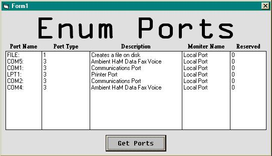



## Enum Ports \(LPT,COM,etc\.\)

### Description

This little program uses heapalloc, getprocessheap, and heapfree api functions to tell you all your ports (LTP,COM,etc.), what they do, and what type of port they are (See screenshot). It's nothing much, but I like it. :) Oh, and if you on a network, you can get the ports of other machines your connected to. Cool, huh? :)
 
### More Info
 
all ports open on your machine (see screenshot)

             |
---                |---
**Submitted On**   |2002-04-30 19:14:30
**By**             |[PyroKid4u2](https://github.com/Planet-Source-Code/PSCIndex/blob/master/ByAuthor/pyrokid4u2.md)
**Level**          |Advanced
**User Rating**    |4.8 (19 globes from 4 users)
**Compatibility**  |VB 4\.0 \(16\-bit\), VB 4\.0 \(32\-bit\), VB 5\.0, VB 6\.0
**Category**       |[Miscellaneous](https://github.com/Planet-Source-Code/PSCIndex/blob/master/ByCategory/miscellaneous__1-1.md)
**World**          |[Visual Basic](https://github.com/Planet-Source-Code/PSCIndex/blob/master/ByWorld/visual-basic.md)
**Archive File**   |[Enum\_Ports155340322003\.zip](https://github.com/Planet-Source-Code/pyrokid4u2-enum-ports-lpt-com-etc__1-43685/archive/master.zip)

